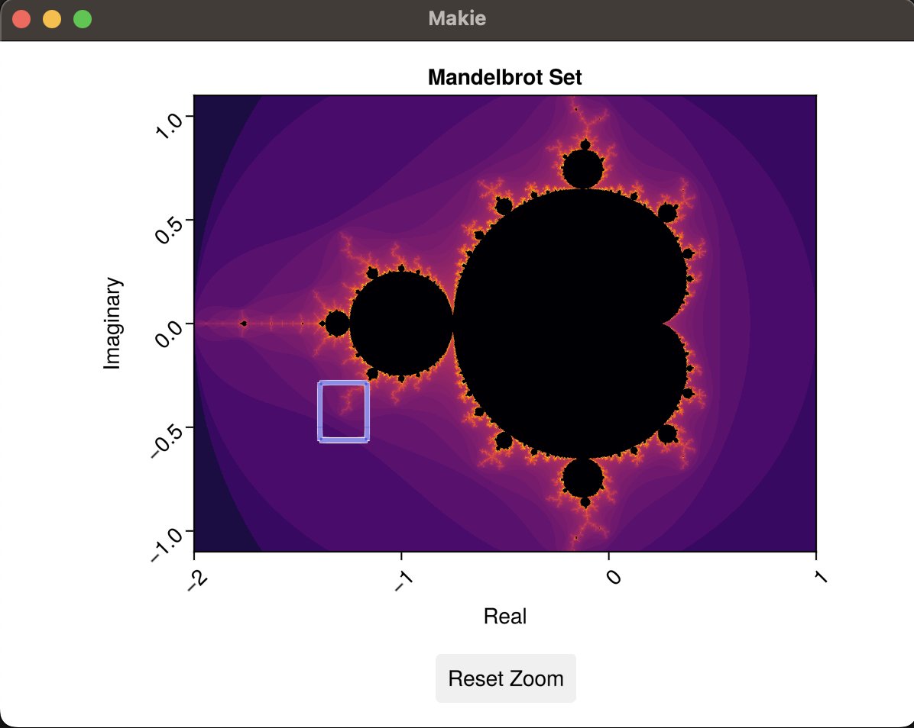
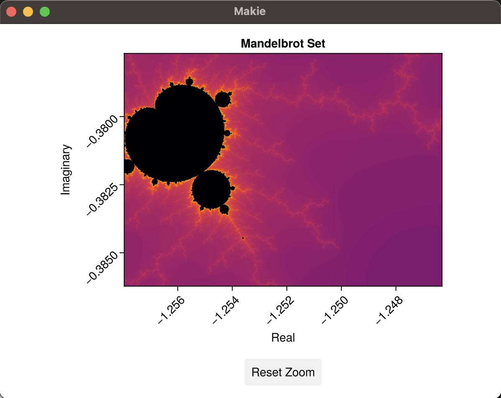

# MandelbrotZoom

MandelbrotZoom is a simple (toy) Julia program that renders and explores the Mandelbrot set, featuring a zoom functionality that allows users to explore different regions of the fractal in detail. This interactive application uses the Makie.jl visualization package.

## Features

- **High-Resolution Mandelbrot Rendering**: Produces a visually rich Mandelbrot set with adjustable detail and resolution for experimenting with the viewing experience.
- **Interactive Zoom Functionality**: Uses GLMakie to enable interactive zooming to dive deeper into areas of the Mandelbrot set.

## Screenshots




## Installation

1. **Clone the Repository**:
   ```bash
   git clone https://github.com/yourusername/MandelbrotZoom.git
   cd MandelbrotZoom
   ```

2. **Install Dependencies**:
   In Julia, activate the project environment to install required packages:
   ```julia
   julia --project=@. -e 'using Pkg; Pkg.instantiate()'
   ```

## Usage

To run MandelbrotZoom, simply use the following command from the repository root:

```bash
julia --project=MandelbrotZoom MandelbrotZoom/src/MandelbrotZoom.jl
```

The application opens a window displaying the Mandelbrot set. You can zoom in on different regions by selecting an area, and the program will render the selected view with high detail.

## Code Overview

### Key Components

- **Main Module (`MandelbrotZoom.jl`)**: The main script that initializes the application, defines the GUI components, and manages rendering.
- **`mandelbrot` Function**: Implements the "escape time" algorithm to compute iteration counts for each point in the complex plane.
- **Zoom Control**: The application captures user clicks to define zoom regions and recalculates the view based on the selected area.
- **Heatmap Rendering**: Uses a high-contrast colormap to render the Mandelbrot set with enhanced visual clarity.

### Functionality Highlights

- **Customizable Parameters**: Play with the code to adjust resolution, aspect ratio, and max iterations for optimal performance and appearance.
- **Observable-Based Interactions**: Uses `Observables` from Makie.jl for responsive, interactive graphics that update in real-time.

## Suggested Enhancements

Consider these potential improvements for future versions:

1. **Try Float128 from Quadmath**: while it slows rendering, you can enable deeper zooming with Float128 instead of the default Float64.
1. **Experiment with Rational(BigNum)**: at some point, Julia's `Rational` data type over `BigNum` may be sophisticated enough to enable even further zooming.
1. **Improved Interactivity**: Add more control elements, such as sliders for zoom level, color settings, and iteration depth.
1. **Pan Functionality**: Enable panning within the Mandelbrot set for more fluid exploration.
1. **Animation Support**: Implement an animation mode to smoothly zoom into predefined regions of the Mandelbrot set.
1. **Save Rendered Images**: Add a feature to save high-resolution PNG images of the current view for further study or sharing.

## License

This project is released under the CC0 1.0 Universal (Public Domain) License.
